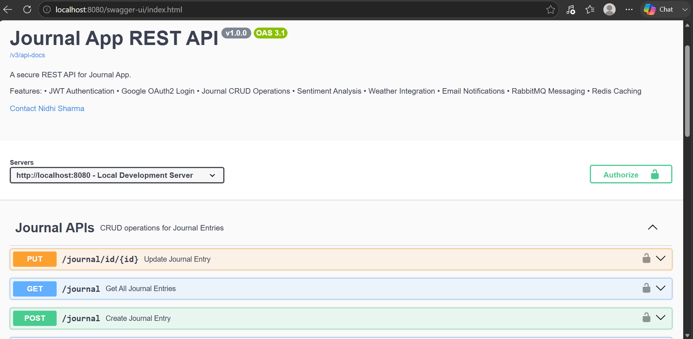
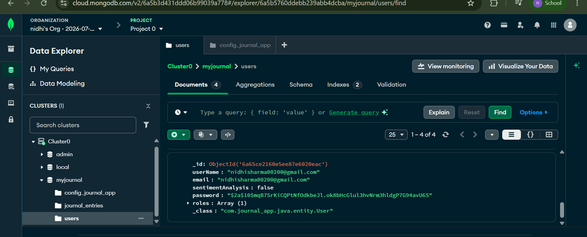

<div align="center">

# 📔 Journal App

### 🚀 Production-Ready Spring Boot Backend with AI-Powered Journal Analysis

<p>
A production-ready <b>Spring Boot backend</b> for secure journal management that combines
<b>JWT Authentication</b>, <b>Google OAuth2</b>, <b>RabbitMQ</b>, <b>Redis</b>,
<b>WeatherStack</b>, <b>ElevenLabs</b>, and an
<b>AI-powered journal analysis microservice</b> using the
<b>Hugging Face Inference API</b>.
</p>

<p>


</p>

<p>

<a href="https://journal-app-springboot-1-ggau.onrender.com">
🌐 Live Backend
</a>
•
<a href="https://journal-app-springboot-1-ggau.onrender.com/swagger-ui/index.html">
📑 Swagger
</a>
•
<a href="https://github.com/nidhi2356/Journal-app-springboot">
💻 Backend Repository
</a>
•
<a href="https://github.com/nidhi2356/journal-ai-service">
🤖 AI Microservice
</a>

</p>

</div>

---

# 📖 About The Project

Journal App is a production-ready backend application built with **Spring Boot** and **Java** that demonstrates modern backend engineering practices through secure authentication, scalable architecture, asynchronous processing, caching, scheduled tasks, and third-party API integrations.

Unlike a traditional CRUD application, Journal App incorporates **AI-powered journal analysis** using a dedicated **FastAPI microservice**. The backend securely communicates with the AI service through REST APIs, where the **Hugging Face Inference API** analyzes users' journal entries and generates personalized emotional insights, weekly reflections, and wellness recommendations.

The project follows a modular architecture that separates business logic, persistence, security, caching, messaging, and AI processing into independent components, making it scalable, maintainable, and production-ready.

---

# ✨ Features

### 🔐 Security

- JWT Authentication
- Google OAuth2 Login
- Spring Security
- BCrypt Password Encryption
- Role-Based Authorization
- Protected REST APIs

---

### 📔 Journal Management

- Create Journal Entries
- Update & Delete Journals
- User-specific Journal Access
- Secure Ownership Validation
- Personal Journal Dashboard

---

### 🤖 AI Journal Analysis

- AI-powered Journal Analysis
- Emotional Insight Generation
- Personalized Weekly Reflections
- Wellness Recommendations
- Hugging Face LLM Integration
- FastAPI AI Microservice

---

### ⚡ Performance & Scalability

- Redis Configuration Caching
- RabbitMQ Asynchronous Messaging
- Scheduled Background Jobs
- Production-ready Layered Architecture

---

### 🌐 Third-party Integrations

- WeatherStack API
- ElevenLabs Text-to-Speech
- Hugging Face Inference API

---

### 🛠 Developer Experience

- Swagger/OpenAPI Documentation
- JUnit Testing
- SLF4J + Logback Logging
- SonarQube Code Analysis
- Render Deployment

---

# 🎯 Project Objectives

This project was developed to demonstrate production-grade backend engineering by combining modern Spring Boot development with AI integration.

Major objectives include:

- Build secure REST APIs using Spring Security.
- Implement JWT and Google OAuth2 authentication.
- Integrate AI-powered journal analysis through a dedicated microservice.
- Improve scalability using RabbitMQ and Redis.
- Consume multiple third-party REST APIs.
- Follow clean architecture and software engineering best practices.
- Deploy a cloud-ready backend application.

---

# 📊 Project Overview

| Property | Details |
|-----------|---------|
| Project Type | Production-ready Backend REST API |
| Language | Java 21 |
| Framework | Spring Boot |
| Architecture | Layered + Microservice |
| Database | MongoDB Atlas |
| Authentication | JWT + Google OAuth2 |
| Security | Spring Security |
| Cache | Redis |
| Messaging | RabbitMQ |
| AI Service | FastAPI |
| AI Model | Hugging Face Inference API |
| External APIs | WeatherStack, ElevenLabs |
| Documentation | Swagger / OpenAPI |
| Logging | SLF4J + Logback |
| Testing | JUnit 5 |
| Build Tool | Maven |
| Deployment | Render |

---

# 📚 Table of Contents

- 📖 About The Project
- ✨ Features
- 🏗 System Architecture
- 🔐 Authentication Flow
- 📔 Journal Workflow
- 🤖 AI Analysis Workflow
- 📨 RabbitMQ Workflow
- ⚡ Redis Workflow
- 🌦 WeatherStack Integration
- 🎤 ElevenLabs Integration
- 📂 Project Structure
- 🛠 Technology Stack
- 📡 API Endpoints
- 🚀 Getting Started
- ⚙ Configuration
- 📑 Swagger Documentation
- 📸 Screenshots
- 🚀 Deployment
- 💡 Engineering Decisions
- 🔮 Future Enhancements
- 👩‍💻 Author

# 🏗 System Architecture

The Journal App follows a **microservice architecture**, where the Spring Boot backend is responsible for authentication, business logic, data management, scheduling, messaging, and third-party integrations, while a dedicated FastAPI service performs AI-powered journal analysis using LangChain and the Hugging Face Inference API.

```text
                                      Client
                                         │
                                         ▼
                           Spring Boot Backend (Java)
                                         │
        ┌────────────────────────────────┼────────────────────────────────┐
        ▼                                ▼                                ▼
 Spring Security                  Journal Service                 External APIs
 JWT + OAuth2                     MongoDB Atlas          WeatherStack • ElevenLabs
        │
        ▼
 Spring Scheduler
        │
        ▼
 Collect Weekly Journal Entries
        │
        ▼
 REST API Call
        │
        ▼
                  FastAPI AI Microservice (Python)
                              │
                              ▼
                  LangChain Prompt Template
                              │
                              ▼
                    ChatHuggingFace Model
                              │
                              ▼
             Hugging Face Inference Endpoint
             (Meta Llama-3.1-8B-Instruct)
                              │
                              ▼
                  Pydantic Output Parser
                              │
                              ▼
               Structured JSON Analysis Response
                              │
                              ▼
                   Spring Boot Backend
                              │
                              ▼
                     RabbitMQ Producer
                              │
                              ▼
                        RabbitMQ Queue
                              │
                              ▼
                      RabbitMQ Consumer
                              │
                              ▼
                        Email Service
                              │
                              ▼
                         User Email
```

---

# 🔐 Authentication Flow

```text
User
 │
 ▼
Login / Google Sign In
 │
 ▼
Spring Security
 │
 ├──────────────┐
 │              │
 ▼              ▼
JWT Login   Google OAuth2
 │              │
 └──────┬───────┘
        ▼
Generate JWT Token
        │
        ▼
Access Protected APIs
```

---

# 📔 Journal Management Workflow

```text
Authenticated User
        │
        ▼
Create / Update Journal
        │
        ▼
Journal Stored in MongoDB
        │
        ▼
Associated with User
        │
        ▼
Available for Weekly AI Analysis
```

---

# 🤖 AI Journal Analysis Workflow

Every week, the backend automatically prepares the user's journal entries and sends them to the AI microservice for contextual analysis.

```text
Spring Scheduler
        │
        ▼
Retrieve Weekly Journals
        │
        ▼
Create WeeklyAnalysisRequest
        │
        ▼
POST /analyze-week
        │
        ▼
FastAPI Route
        │
        ▼
Service Layer
        │
        ▼
Merge Journal Entries
        │
        ▼
LangChain Prompt Template
        │
        ▼
ChatHuggingFace
        │
        ▼
Meta Llama 3.1 (Hugging Face Endpoint)
        │
        ▼
LLM Response
        │
        ▼
Pydantic Output Parser
        │
        ▼
Structured JSON Response
        │
        ▼
Spring Boot Backend
```

---

# 📋 AI Response Structure

The AI service returns a structured response instead of raw text.

```json
{
  "dominantEmotion": "...",
  "mentalWellnessScore": 0,
  "weeklySummary": "...",
  "positiveMoments": [],
  "challenges": [],
  "recommendations": [],
  "motivationalQuote": "...",
  "nextWeekFocus": "..."
}
```

---

# 🧠 AI Analysis Features

The AI microservice performs contextual journal analysis using **LangChain**, **Meta Llama 3.1**, and **Pydantic Output Parsing**.

### It generates

- Dominant emotional pattern
- Mental wellness score
- Weekly journal summary
- Positive moments
- Key challenges
- Personalized wellness recommendations
- Motivational quote
- Next week's focus

Unlike keyword-based sentiment analysis, the model understands the context across multiple journal entries to generate personalized insights.

---

# 📨 RabbitMQ Workflow

```text
Spring Boot Backend
        │
        ▼
Generate Weekly Analysis
        │
        ▼
Publish Email Request
        │
        ▼
RabbitMQ Exchange
        │
        ▼
RabbitMQ Queue
        │
        ▼
Consumer Service
        │
        ▼
Email Service
        │
        ▼
User Receives Weekly Reflection
```

---

# ⚡ Redis Workflow

```text
Weather Request
        │
        ▼
Check Redis Cache
        │
   ┌────┴────┐
   │         │
Hit        Miss
 │           │
 ▼           ▼
Return    MongoDB
Cached       │
Config       ▼
        Store in Redis
              │
              ▼
      Call WeatherStack API
```
# 📡 REST API Overview

The Spring Boot backend exposes REST APIs grouped by business functionality.

| Module | Description |
|---------|-------------|
| Authentication | User Registration, Login & Google OAuth2 |
| Journal | Create, Update, Delete & View Journal Entries |
| User | User Profile Management |
| Weather | Current Weather Information |
| Speech | Convert Journal Entries to Speech |
| Admin | Administrative Operations |

---

# 🔗 Major API Groups

## 🔐 Authentication APIs

| Method | Endpoint | Description |
|---------|----------|-------------|
| POST | `/public/signup` | Register a new user |
| POST | `/public/login` | Authenticate user |
| GET | `/oauth2/authorization/google` | Google OAuth2 Login |

---

## 📔 Journal APIs

| Method | Endpoint | Description |
|---------|----------|-------------|
| POST | `/journal` | Create Journal Entry |
| GET | `/journal` | Get User Journals |
| GET | `/journal/{id}` | Get Journal by ID |
| PUT | `/journal/{id}` | Update Journal |
| DELETE | `/journal/{id}` | Delete Journal |

---

## 🌦 Weather APIs

| Method | Endpoint | Description |
|---------|----------|-------------|
| GET | `/weather` | Retrieve Current Weather |

---

## 🎤 Speech APIs

| Method | Endpoint | Description |
|---------|----------|-------------|
| POST | `/speech/{journalId}` | Convert Journal Entry to Speech |

---

# 🤖 AI Integration

The backend integrates with a dedicated **FastAPI AI microservice** to provide AI-powered journal analysis.

Instead of embedding AI logic inside the Spring Boot application, the backend communicates with the AI service using REST APIs, allowing both services to evolve independently.

### AI Workflow

1. Spring Scheduler retrieves journal entries from the previous week.
2. The backend creates a `WeeklyAnalysisRequest`.
3. Journal entries are sent to the FastAPI AI microservice.
4. The AI service analyzes the journals using **LangChain** and the **Hugging Face Inference Endpoint**.
5. A structured JSON response containing emotional insights and recommendations is returned.
6. Spring Boot publishes the response to RabbitMQ.
7. The Email Service delivers the personalized weekly reflection to the user.

> 📌 The AI microservice is maintained in a separate repository:

**AI Repository:**  
https://github.com/nidhi2356/journal-ai-service

---

# 🚀 Getting Started

## Prerequisites

Before running the project, install:

- Java 21
- Maven
- MongoDB Atlas
- Redis
- RabbitMQ
- Git

---

## Clone the Repository

```bash
git clone https://github.com/nidhi2356/Journal-app-springboot.git
```

```bash
cd Journal-app-springboot
```

---

## Install Dependencies

```bash
mvn clean install
```

---

## Run the Backend

```bash
mvn spring-boot:run
```

The backend starts on:

```
http://localhost:8080
```

---

# 🤖 AI Microservice Setup

This project depends on a dedicated AI service for journal analysis.

Clone the AI repository:

```bash
git clone https://github.com/nidhi2356/journal-ai-service.git
```

Follow the setup instructions in the AI repository before starting the backend.

Once running, configure the backend to use the AI service URL.

---

# ⚙ Configuration

Configure the following environment variables before running the application.

| Variable | Purpose |
|----------|---------|
| MongoDB URI | MongoDB Atlas Connection |
| JWT Secret | JWT Signing Key |
| Google Client ID | OAuth2 Client ID |
| Google Client Secret | OAuth2 Client Secret |
| Redis Host | Redis Configuration |
| RabbitMQ Host | RabbitMQ Configuration |
| WeatherStack API Key | Weather Service |
| ElevenLabs API Key | Text-to-Speech Service |
| AI Service URL | FastAPI AI Endpoint |
| Mail Username | SMTP Username |
| Mail Password | SMTP Password |

---

# 📑 API Documentation

Interactive Swagger documentation is available at:

```
http://localhost:8080/swagger-ui/index.html
```

Using Swagger you can:

- Explore all REST APIs
- Authenticate using JWT
- Execute API requests
- View request/response models
- Test endpoints without Postman

---

# 🔗 Related Repositories

| Repository | Purpose |
|------------|---------|
| Journal App (Spring Boot) | Main backend application |
| Journal AI Service | AI-powered journal analysis microservice |

**Spring Boot Backend:**  
https://github.com/nidhi2356/Journal-app-springboot

**AI Microservice:**  
https://github.com/nidhi2356/journal-ai-service

# 🌍 Deployment

The application is deployed on **Render** for public access.

### 🔗 Live Services

| Service | URL |
|----------|-----|
| Backend | https://journal-app-springboot-1-ggau.onrender.com |
| Swagger UI | https://journal-app-springboot-1-ggau.onrender.com/swagger-ui/index.html |
| AI Microservice | *(Runs as an independent FastAPI service)* |

---

### Before Deployment

Configure the following services:

- MongoDB Atlas
- Redis Cloud
- CloudAMQP (RabbitMQ)
- WeatherStack API
- ElevenLabs API
- Hugging Face Token
- Google OAuth2 Credentials
- SMTP Email Credentials

The backend communicates with the AI microservice through REST APIs and requires the AI service URL to be configured before deployment.

---

# 📸 Screenshots

## 📑 Swagger Documentation

Interactive API documentation generated using Swagger/OpenAPI.

<p align="center">

</p>

---

## 🍃 MongoDB Atlas

MongoDB Atlas stores users, journal entries, and application configuration.

<p align="center">

</p>

---

## 📧 Weekly Reflection Email

Example of the personalized AI-generated weekly reflection email.

<p align="center">

</p>

---

## 🤖 AI Analysis Response

Example response returned by the AI microservice.

```json
{
  "dominantEmotion": "Happy",
  "mentalWellnessScore": 84,
  "weeklySummary": "...",
  "positiveMoments": [
    "...",
    "..."
  ],
  "challenges": [
    "...",
    "..."
  ],
  "recommendations": [
    "...",
    "..."
  ],
  "motivationalQuote": "...",
  "nextWeekFocus": "..."
}
```

---

# 💡 Engineering Decisions

This project was designed with scalability, maintainability, and modularity in mind.

| Decision | Reason |
|----------|--------|
| Spring Boot | Build production-ready REST APIs |
| Layered Architecture | Clear separation of concerns |
| JWT Authentication | Stateless authentication |
| Google OAuth2 | Secure social login |
| MongoDB Atlas | Flexible document storage |
| Redis | Reduce repeated configuration lookups |
| RabbitMQ | Asynchronous email processing |
| FastAPI Microservice | Decouple AI processing from backend |
| LangChain | Prompt management & structured LLM interaction |
| Hugging Face Endpoint | AI-powered contextual journal analysis |
| Pydantic Output Parser | Reliable structured JSON responses |
| Swagger | Interactive API documentation |
| SLF4J + Logback | Centralized logging |
| JUnit | Unit testing |
| Render | Cloud deployment |

---

# 🚀 Future Enhancements

Planned improvements include:

- 📱 React / Next.js frontend
- 📊 Personal wellness dashboard
- 📈 Monthly emotional trend analysis
- 🎙 Voice journal entries
- 🖼 Image-based journal entries
- 🔍 Semantic journal search using vector embeddings
- 📄 PDF export for journals and AI reports
- 🔔 Push notifications
- 🐳 Docker containerization
- ☸ Kubernetes deployment
- 🔄 CI/CD using GitHub Actions
- 📊 Monitoring with Prometheus & Grafana
- 📈 OpenTelemetry distributed tracing
- 🌐 Multi-language AI journal analysis

---

# ⭐ Project Highlights

✔ Production-ready Spring Boot backend

✔ Secure authentication using JWT & Google OAuth2

✔ AI-powered journal analysis using LangChain & Hugging Face

✔ FastAPI microservice architecture

✔ Redis caching

✔ RabbitMQ asynchronous messaging

✔ WeatherStack & ElevenLabs integrations

✔ Automated weekly AI reflections

✔ Interactive Swagger documentation

✔ Cloud deployment on Render

# 🤝 Contributing

Contributions are welcome!

If you'd like to improve the project, add new features, or fix bugs, feel free to contribute.

### Contribution Steps

1. Fork the repository.
2. Create a feature branch.

```bash
git checkout -b feature/your-feature-name
```

3. Commit your changes.

```bash
git commit -m "feat: Add new feature"
```

4. Push the branch.

```bash
git push origin feature/your-feature-name
```

5. Open a Pull Request.

---

# 📌 Roadmap

The project will continue evolving with new backend and AI capabilities.

### Planned Features

- ✅ AI-powered weekly reflections
- 🔄 Monthly AI wellness reports
- 🔄 Semantic journal search
- 🔄 AI chatbot for journal conversations
- 🔄 Voice journal transcription
- 🔄 Image-based journal entries
- 🔄 Docker support
- 🔄 Kubernetes deployment
- 🔄 GitHub Actions CI/CD
- 🔄 Monitoring with Prometheus & Grafana

---

# 👩‍💻 Author

## Nidhi Sharma

Backend Developer | Java & Spring Boot | AI Integration

📧 Email

nidhisharma00200@gmail.com

💼 LinkedIn

https://linkedin.com/in/Nidhi-Sharma2

💻 GitHub

https://github.com/nidhi2356

---

# 📚 Related Projects

### 📔 Journal AI Service

The Journal Application integrates with a dedicated AI microservice responsible for contextual journal analysis using LangChain and Hugging Face Inference Endpoints.

Repository:

https://github.com/nidhi2356/journal-ai-service

---

# 🙏 Acknowledgements

Special thanks to the teams and open-source communities behind:

- Spring Boot
- Spring Security
- MongoDB Atlas
- Redis
- RabbitMQ
- FastAPI
- LangChain
- Hugging Face
- Swagger / OpenAPI
- WeatherStack
- ElevenLabs
- SonarQube

---

# ⭐ Support

If you found this project useful:

⭐ Star this repository

🍴 Fork the project

🐞 Report bugs

💡 Suggest new features

Every contribution and suggestion is greatly appreciated.

---

# 📄 License

This project is licensed under the **MIT License**.

You are free to use, modify, and distribute this project under the terms of the MIT License.

---

<div align="center">

## 🚀 Built with Java, Spring Boot, FastAPI, LangChain & Hugging Face

### Thanks for visiting the repository ❤️

If you enjoyed this project, don't forget to ⭐ the repository!

</div>
